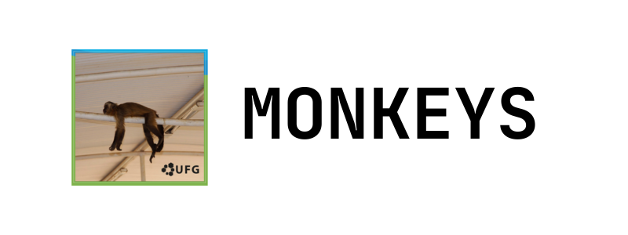

# Bem vindo

<figure markdown="span">
  { width="1000" }
</figure>

## Monkeys UFG

Bem-vindo ao site do Grupo de Programação Competitiva da Universidade Federal de Goiás (UFG)!

Este site tem como objetivo ser um guia para estudantes interessados em participar de competições de programação, como a [Olimpíada Brasileira de Informática (OBI)](https://olimpiada.ic.unicamp.br/) e a [Maratona SBC de Programação](https://maratona.sbc.org.br/). Aqui, você encontrará uma coleção de artigos elaborados por nossos membros, além de diversas referências para o aprendizado dos tópicos mais relevantes da programação competitiva.

## Seções do Site:

**Blog**: Fique por dentro das novidades, conquistas e eventos do grupo Monkeys.

**Iniciando na OBI/Maratona**: Um guia completo para estudantes que querem começar a participar das competições de programação!

**Biblioteca**: Biblioteca com implementações de algoritmos utilizadas pelo grupo Monkeys.

**Sites**: Conheça os principais sites para programação competitiva e como aproveitá-los ao máximo.

**Membros**: Conheça os integrantes do grupo Monkeys e suas contribuições.

## Dúvidas?
Se você tiver alguma dúvida, não hesite em entrar em contato conosco!

Na UFG: Laboratório 252 - INF

Online:

