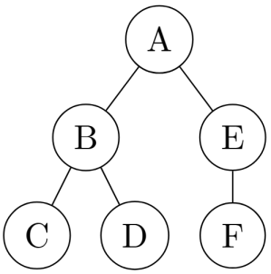
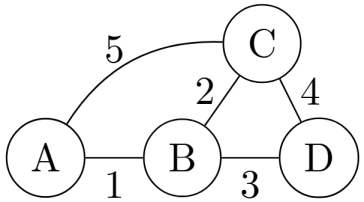

# Classes

Essa seção apresenta as principais classes de grafos.

## Árvore
Uma árvore é um tipo de grafo geralmente utilizado para representar uma hierarquia entre os vértices. O vértice mais acima é chamado de Raiz, e a altura de cada vértice representa a sua distância até a raiz. Um vértice que não tem filhos é chamado de Folha. Chamamos de floresta um grafo em que todas suas componentes conexas são uma árvore.

<figure markdown="span" class="graphs"> 
    
</figure>
Árvore cuja raiz é o vertice A, e as folhas são os vértices C, D e F.

!!!tip "Características de árvorre"
    - Um vértice pode ter vários filhos, porém tem um único pai.
    - Possui exatamente $N-1$ arestas, sendo $N$ o número de vértices. 
    - Existe apenas um caminho entre dois vértices. 
    - Não apresenta ciclos 

## Grafos Direcionados
Um grafo direcionado ou orientado é um grafo em que suas arestas possuem um sentido.
Se um par $(U,V)$ pertence ao conjunto $E$ de arestas, então existe um caminho de $U$ para $V$,
mas não necessariamente existe um caminho de $V$ para $U$.

!!!tip "Representação das arestas"
    No grafo direcionado, as arestas geralmente são representadas por setas. 

<figure markdown="span" class="graphs"> 
    
</figure>

$$
\begin{aligned}
&\hphantom{..............}
V = \{A, B, C, D\} \\
&E = \{(A, B),\ (A, C),\ (B, C),\ (D, B),\ (C, D)\}
\end{aligned}
$$

No grafo acima, existe uma aresta entre os vértices $A$ e $C$, no entando não há um caminho que saia de $C$ e chegue em $A$. Em contrapartida, existe a aresta $(B,C)$ com um caminho saindo de $C$ que chega em $B$, passando pelo vértice $D$.

## Grafo Ponderado
Um grafo ponderado é um grafo que cada aresta possui um peso, ou seja, um valor. Formalmente, existe uma função $W$ que relaciona o conjunto de arestas $E$ do grafo aos numeros reais $\mathbb{R}$. Os pesos podem representar, por exemplo, custo ou distância entre os vértices.

<figure markdown="span" class="graphs"> 
    
</figure>

$$
\begin{aligned}
    W(A,B) = 1 \\
    W(B,C) = 2 \\
    W(B,D) = 3 \\
    W(C,D) = 4 \\
    W(A,C) = 5
\end{aligned}
$$

