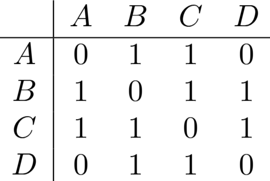

# Representação

Nessa seção veremos maneiras de representar um grafo em código.
Os exemplos serão baseados no seguinte grafo:

 
    

## Matriz de Adjacência
Representamos o grafo como uma matriz $M$ de dimensão $N*N$, sendo $N$ o número de vértices. Podemos
descobrir se existe uma aresta entre $U$ e $V$ em tempo $O(1)$ apenas olhando para $M[U][V]$. No entanto, a complexidade de 
memória é $O(N^2)$, o que pode ser inviável se o grafo tiver muitos vértices e poucas arestas (Grafos Esparsos).

$$
M[U][V] = \begin{cases}
0, & (U,V) \notin E \\
1, & (U,V) \in E
\end{cases}
$$

 
    

Exemplo da matriz de Adjacência do grafo desenhado anteriormente.

## Lista de Adjacência
Para todo vértice $U$ do grafo, fazemos uma estrutura que armazena todo vértice $V\in N(U)$, ou seja, todo vértice $V$
na vizinhança de $U$. A complexidade de tempo para determinar se existe uma aresta entre os vértices $U$ e $V$ dependerá
da estrutura utilizada. Em grafos esparsos, a memória utilizada é consideravelmente menor do que em matrizes de adjacencia.

 
    

Exemplo da lista de Adjacência do grafo desenhado anteriormente.
