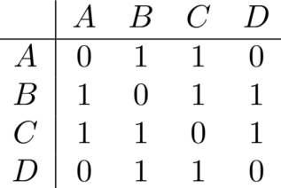

# Representação

Nessa seção veremos maneiras de representar um grafo em código.
Os exemplos serão baseados no seguinte grafo:
<figure markdown="span" class="graphs"> 
    
</figure>

## Matriz de Adjacência
Representamos o grafo como uma matriz $M$ de dimensão $N*N$, sendo $N$ o número de vértices. Podemos
descobrir se existe uma aresta entre $U$ e $V$ em tempo $O(1)$ apenas olhando para $M[U][V]$. No entanto, a complexidade de 
memória é $O(N^2)$, o que pode ser inviável se o grafo tiver muitos vértices e poucas arestas (Grafos Esparsos).

$$
M[U][V] = \begin{cases}
0, & (U,V) \notin E \\
1, & (U,V) \in E
\end{cases}
$$

<figure markdown="span" class="graphs"> 
    
</figure>
Exemplo da matriz de Adjacência do grafo desenhado anteriormente.

```cpp title="adj_matrix.cpp"
#include <bits/stdc++.h>
using namespace std;

const int N = 1e3+5; ///número náximo de vértices do grafo
int adj[N][N]; //matriz de adjacência
int n,m; //numero de vértices e arestas

int main(){
    cin>>n>>m;

    for(int i=0;i<m;i++){
        int u,v;
        cin>>u>>v;

        adj[u][v] = 1;
        adj[v][u] = 1;
    }
}
```

## Lista de Adjacência
Para todo vértice $U$ do grafo, fazemos uma estrutura que armazena todo vértice $V\in N(U)$, ou seja, todo vértice $V$
na vizinhança de $U$. A complexidade de tempo para determinar se existe uma aresta entre os vértices $U$ e $V$ dependerá
da estrutura utilizada. Em grafos esparsos, a memória utilizada é consideravelmente menor do que em matrizes de adjacencia.

<figure markdown="span" class="graphs"> 
    
</figure>
Exemplo da lista de Adjacência do grafo desenhado anteriormente.

```cpp title="adj_list.cpp"
#include <bits/stdc++.h>
using namespace std;

const int N = 2e5+5; ///número náximo de vértices do grafo
vector<int> adj[N]; //lista de adjacência
int n,m; //numero de vértices e arestas

int main(){
    cin>>n>>m;

    for(int i=0;i<m;i++){
        int u,v;
        cin>>u>>v;

        adj[u].push_back(v);
        adj[v].push_back(u);
    }
}
```